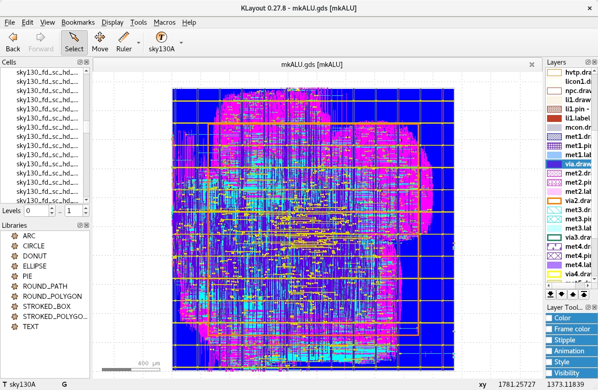

This repository contains a design of a VLIW multi-ALU CPU designed
using Bluespec.

For the ALU block here is the final view on SKYWATER 130A produced by OpenROAD (Librelane) flow

The metrics are in the file ALU_metrics.json

